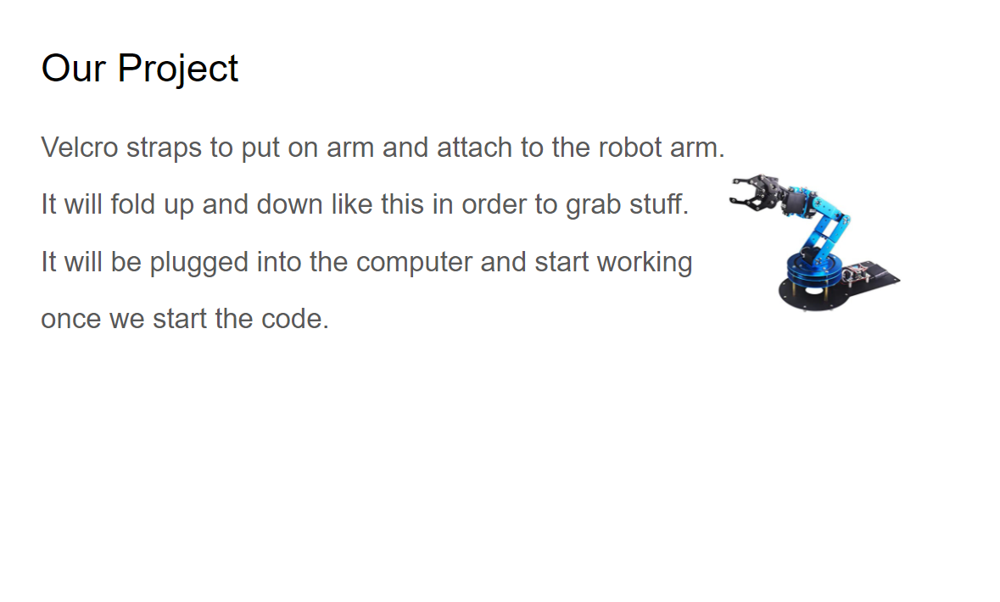
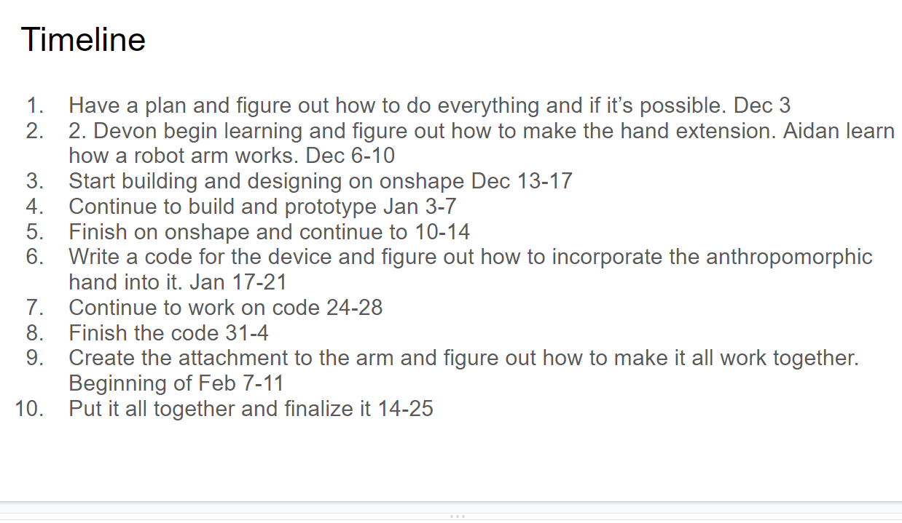
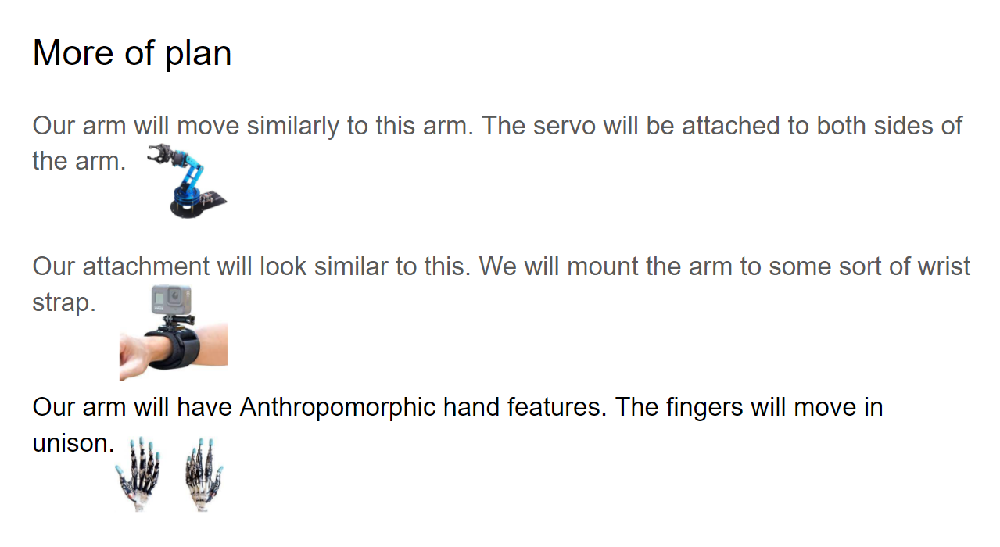
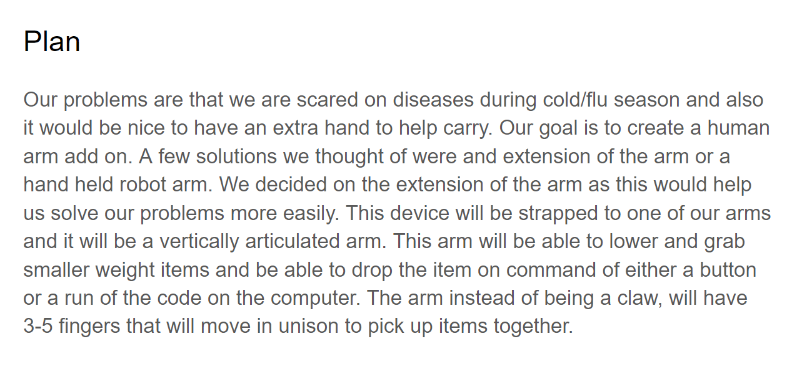
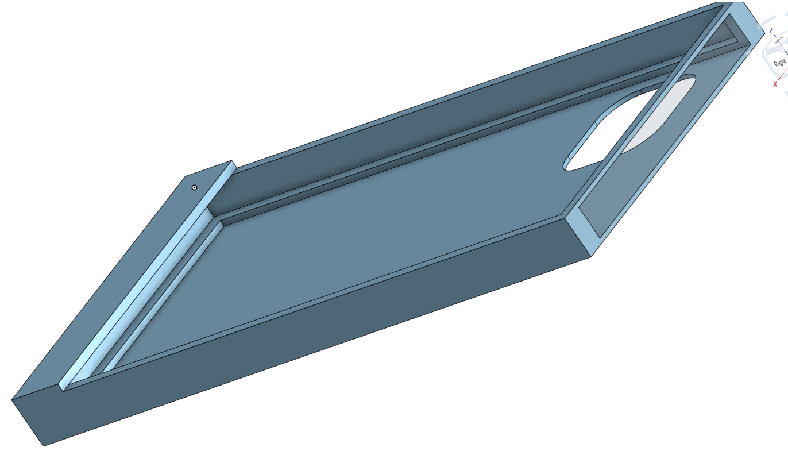
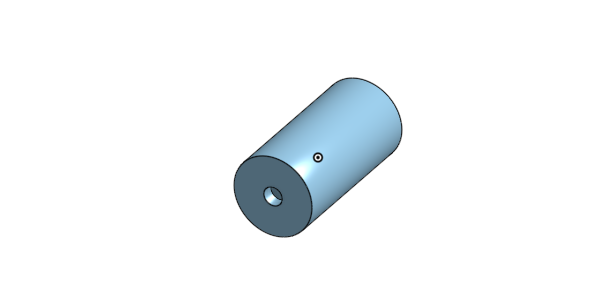
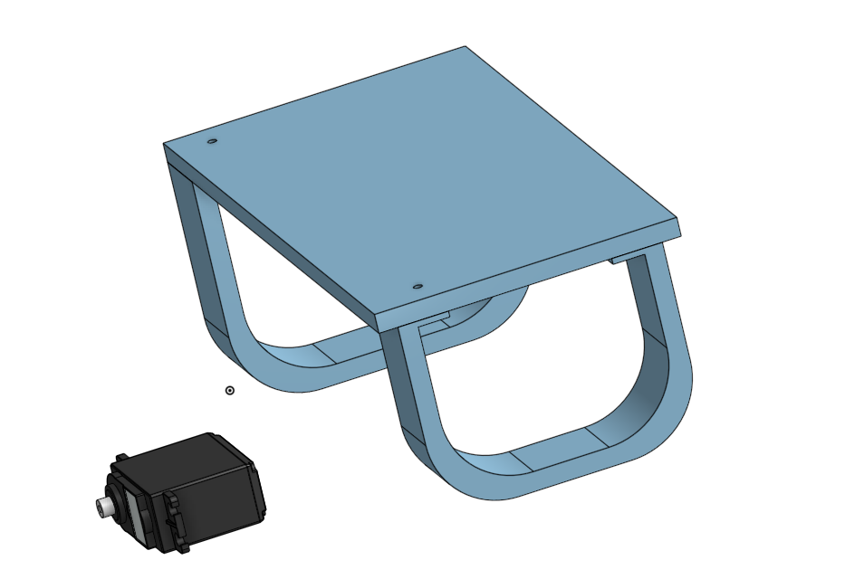
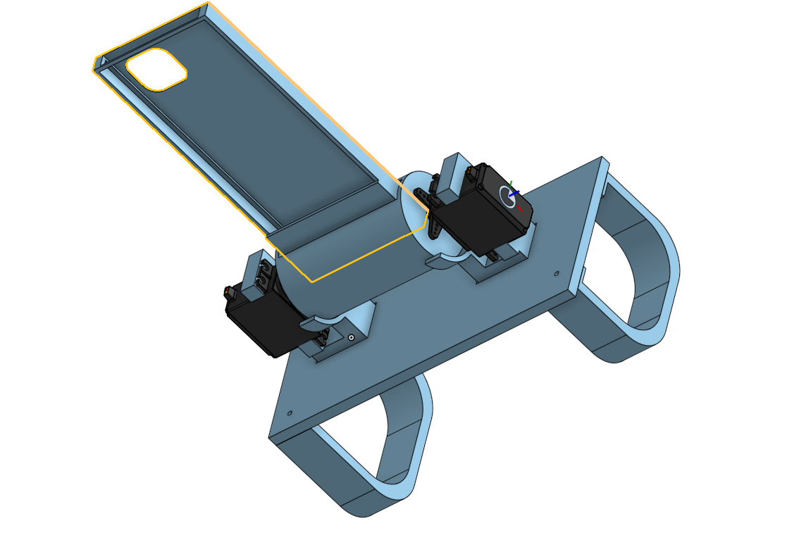
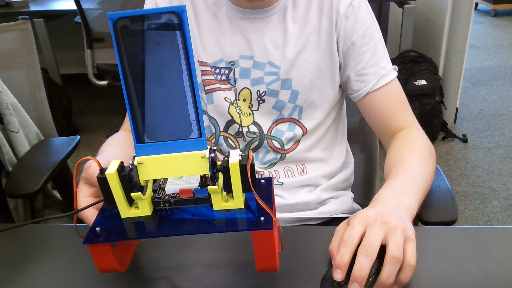

# Robot arm extension


## Project original planning









## Update on Plan

1/25 We revised the plan and took out the anthropomorphic feature due to added difficulty. We decided toe build a phone holder in order to we able to help multi task. The new idea will give us an easy way to watch a show on your phone while also playing cards, playing catch, or working on your computer. 

## Milestone 1

1/31 As of right now, we have finished the arm attachment and the phone holder. Next we need to find a code, and wire up servos to make the phone rotate back and forth. We have achieved our first milestone because we built the 2 parts we said we would. These a pictures of our finished parts in cad. The first is the phone holder, the second is the axle that the servos will use to turn, the third is the arm attachment.







## Finish assembly

2/7 Today I finished all of the parts and assembly. This picture shows a phone holder attached to an axel and 2 servos. The servos will rotate forward and backward to the person's liking. The objective of the project is to make a arm attachment that will hold a phone while giving you the freedom to move both hands. This project will allow you to eat, watch the news, and use the other hand for fidgiting, playing cards, or just resting.



## Code

```
import time
import board
import pwmio
from adafruit_motor import servo

# create a PWMOut object on Pin A2.
pwm = pwmio.PWMOut(board.A2, duty_cycle=2 ** 15, frequency=50)

# Create a servo object, my_servo.
my_servo = servo.Servo(pwm)


while True:
    for angle in range(0, 180, 5):   # 0 - 180 degrees, 5 degrees at a time.
        my_servo.angle = angle
        time.sleep(0.05)
    for angle in range(180, 0, -5):  # 180 - 0 degrees, 5 degrees at a time.
        my_servo.angle = angle
        time.sleep(0.05)
```

The code still isn't fully working. It should be done soon but this is where we are at now.

## Finished Code


```
import board
import time
import pwmio
from digitalio import DigitalInOut, Direction, Pull
from adafruit_motor import servo


btn = DigitalInOut(board.D9)
btn.direction = Direction.INPUT

# create a PWMOut object on Pin A2.
pwm = pwmio.PWMOut(board.A2, duty_cycle=2 ** 15, frequency=50)
pwt = pwmio.PWMOut(board.A3, duty_cycle=2 ** 15, frequency=50)
# Create a servo object, my_servo.
my_servo = servo.Servo(pwm)
my_servo2 = servo.Servo(pwt)
angle = 0
lowEnd = 60
topEnd = 90

while True:
    if btn.value:
        print("up")
        if angle < topEnd -5:
            for angle in range(lowEnd, topEnd, 5):   # 0 - 180 degrees, 5 degrees at a time.
                my_servo.angle = angle
                my_servo2.angle = (180-angle)
                time.sleep(0.05)
                print(angle)
    else:    
        print("DOWN")
        if angle > lowEnd + 5:
            for angle in range(topEnd, lowEnd, -5):  # 180 - 0 degrees, 5 degrees at a time.
                my_servo.angle = angle
                my_servo2.angle = (180-angle)
                time.sleep(0.05)
                print(angle)
    print("done")
    time.sleep(1)

    # if, when you're done, the servos are twitchy, we may need to add an extra "if" abovve the servo code
    # the new if's job would be to only run servo code IF the angle value has changed (or changed more than x%).
```
We finally finish our project and got the code to work. We have the phone moving a certain angle everytime you flip the switch. This project was great challenge due to my previous inexperience in codeing since engineering 2 was during covid. We thought we weren't going to finish but we never gave up and beat every hard challenge that we encounterned. Now that we finsihed our project we feel relieved.
Lessons that we learned, even if the odds are against you, never give up. Another lesson that we learned was somethings take a extra little shove to fit. And always remember hard work and dadication pays off.




